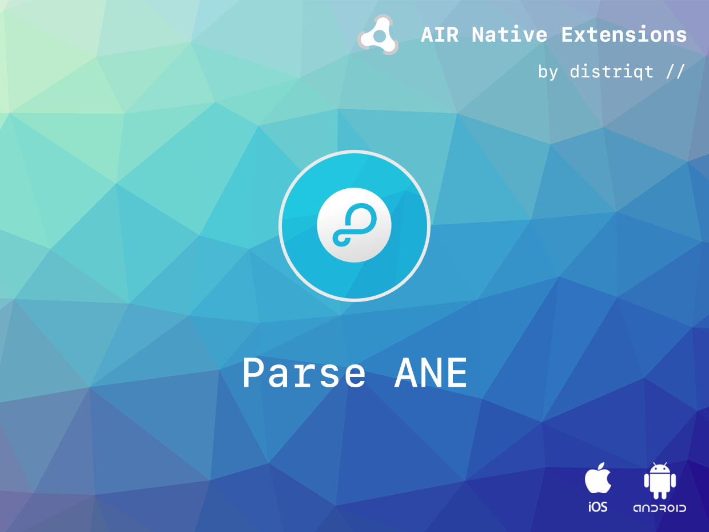
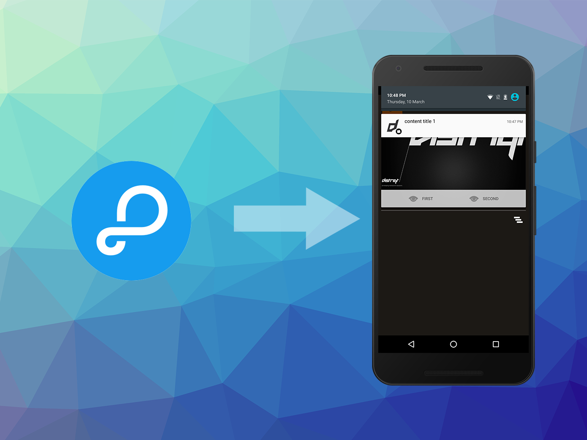

# Parse

The [Parse](https://airnativeextensions.com/extension/com.distriqt.Parse) 
extension allows developers to deeply integrate Parse on both Android and iOS.

Focus on creating amazing user experiences and forget complex infrastructure. 
Instantly add a powerful cloud database, push notification services, and analytics tracking 
to your app. Choose from over thirteen native SDKs for mobile, desktop, and IoT devices 
and discover all that Parse has to offer.

This ANE integrates important aspects of the native Parse SDK that cannot be accessed via 
the REST API, mainly the push notifications registration process. The simple API allows you 
to quickly integrate Parse push notifications in your AIR application in just a few lines 
of code. Identical code base can be used across all platforms allowing you to concentrate 
on your application and not device specifics.

We provide complete guides to get you up and running with Parse Push quickly and easily.

As with all our extensions you get access to a year of support and updates as we are continually 
improving and updating the extensions for OS updates and feature requests.

### Features

- Push: Add Parse Push Notifications to your application
- Subscribe and manage notification channels
- Startup Notification: Receive notifications on application start if the user started from a notification
- Single API: Your code will work across iOS and Android without modifications
- Sample project code and ASDocs reference

This Wiki forms the best source of detailed documentation for the extension along with 
the [asdocs](https://distriqt.github.io/ANE-Parse/asdocs). 

