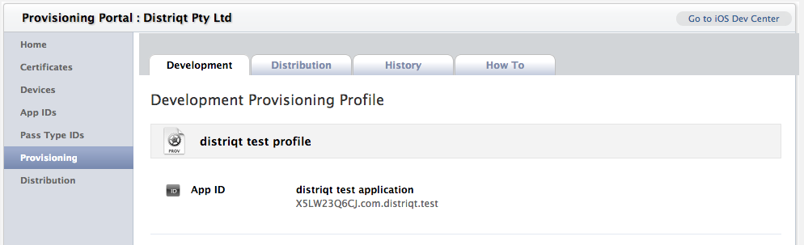

## Configuring your iOS application for Push

The Parse website has a guide on getting your applicaiton configured correctly in 
the Apple Developer website, including setting up certificates. This is slightly 
different from our Push Notifications process but only slightly and mainly in the 
passwords you need to set on the certificates.

The guide can be found here: https://parse.com/tutorials/ios-push-notifications

### Info Additions

You need to add certain Entitlements to your application to be able to use Push Notifications.

```xml
<iPhone>
	<InfoAdditions><![CDATA[
		<key>UIDeviceFamily</key>
		<array>
		<string>1</string>
		</array>
		)>
	</InfoAdditions>
	<requestedDisplayResolution>high</requestedDisplayResolution>
	<Entitlements><![CDATA[
		<key>get-task-allow</key>
		<true/>
		<key>aps-environment</key>
		<string>development</string>
		<key>application-identifier</key>
		<string>X5LW23Q6CJ.com.distriqt.test</string>
		<key>keychain-access-groups</key>
		<array>
			<string>X5LW23Q6CJ.*</string>
		</array>
	)></Entitlements>
</iPhone>
```

These all relate to your application’s entry in the iOS Provisioning Portal.

The first field is the `aps-environment`. This field indicates whether we are using the 
development or the production environment. It must be either `development` or `production` 
and depends on which configuration you are using. If you are running a debug build you 
should use `development`. If you are looking to publish the application to the AppStore, 
you should use `production`.

If you took note of the applications Bundle Seed ID (App ID Prefix) and Bundle Identifier 
(App ID Suffix) previously then you can use them here, otherwise see the next section 
on how to “Acquire the App ID Prefix and Suffix” and return here with that information.

An App ID is the combination of a unique ten character string called the "Bundle Seed ID" 
and a traditional CF Bundle ID (or Bundle Identifier). The Bundle Seed ID portion of your
App ID can be utilized to share keychain access between multiple applications you build 
with a single App ID. In addition, it can be incorporated into any external hardware 
accessories you wish to pair your iOS application with. Registration of your App ID is 
required to utilize the Push Notifications (APNs) and to register an application to 
incorporate In-App Purchases.

The Bundle Seed ID or App ID Prefix is the first part of the full application ID, 
`application-identifier`, that you must supply in the application descriptor. It should 
be of the form of 10 alpha-numeric characters, in our example case its `X5LW23Q6CJ`. 
You should enter this value into the `keychain-access-groups` field.

The second part of the `application-identifier` is the Bundle Identifier (App ID Suffix) 
and is what we normally consider the AIR application ID.

You should be able to construct the full application ID now and insert it into the 
`application-identifier` field. This is as follows:

```
[BUNDLE SEED ID].[BUNDLE IDENTIFIER]
```

Eg:

```
X5LW23Q6CJ.com.distriqt.test
```

### Acquire the App ID Prefix and Suffix

To acquire the Bundle Seed ID and the Bundle Identifiers you need to log into the iOS Provisioning Portal.

Select “Provisioning” from the menu and locate the provisioning profile for your application and click on it. You should be displayed with the following screen, showing the App ID which is of the format:

```
[BUNDLE SEED ID].[BUNDLE IDENTIFIER]
```




